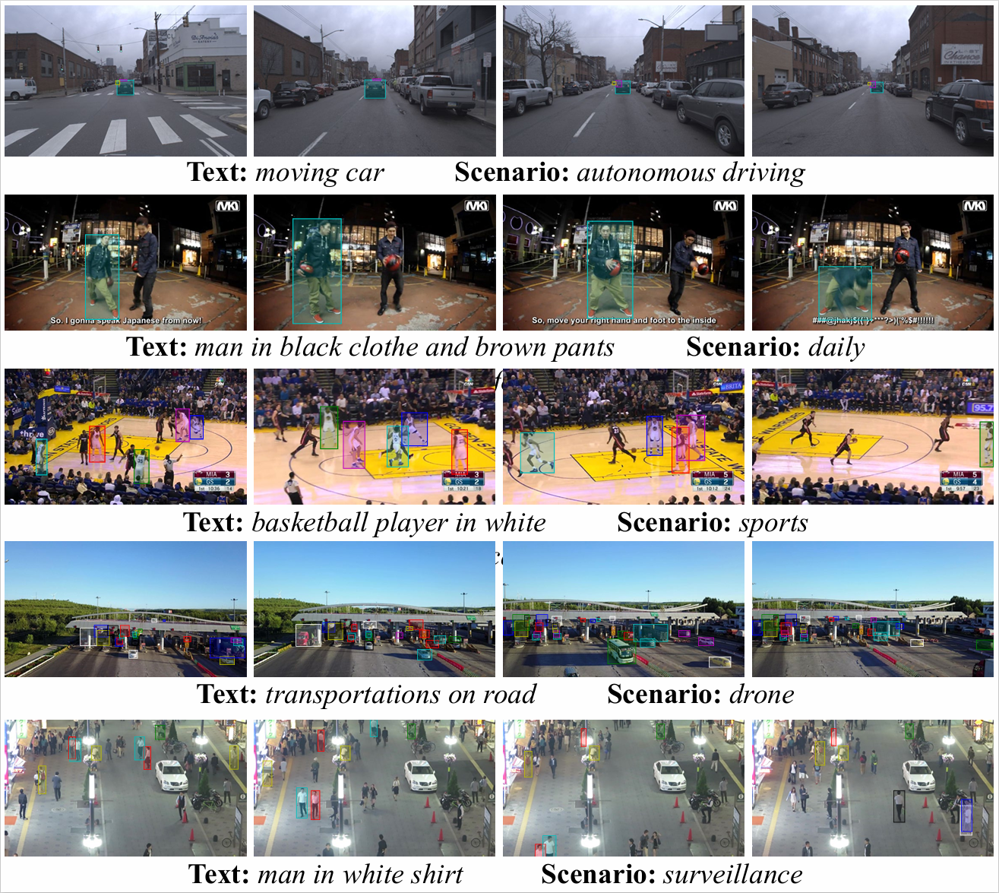

## LaMOT: Language-Guided Multi-Object Tracking
LaMOT: Language-Guided Multi-Object Tracking <br>
Yunhao Li, Xiaoqiong Liu, Luke Liu, Heng Fan, Libo Zhang <br>
`paper` `dataset`

 <br>
**Figure**: We introduce a large-scale benchmark, termed LaMOT, which comprises 1,660 sequences, 1.67M frames, and over 18.9K target trajectories. LaMOT contains videos from 4 MOT datasets, including *MOT17*, *TAO*, *SportsMOT*, and *VisDrone2019*. It encompasses five different video perspectives including *surveillance*, *autonomous driving*, *sports broadcasting*, *drone*, and *daily life*. To our knowledge, LaMOT is the first benchmark dedicated to Language-Guided MOT.

### Organization
We provide the annotations in the following manner:
```text
annotations
├── train
|   └──MOT17
|       └──MOT17-02-FRCNN_01.json
|       ...
|   └──VisDrone
|       └──uav0000013_00000_v_01.json
|       └──uav0000013_00000_v_02.json
|       ...
|   └──SportsMOT
|       └──v_00HRwkvvjtQ_c001_01.json
|       └──v_00HRwkvvjtQ_c001_02.json
|       ...
|   └──TAO
|       └──ArgoVerse
|           └──00c561b9-2057-358d-82c6-5b06d76cebcf_01.json
|           ...
|       └──LaSOT
|           └──airplane-3_01.json
|           └──basketball-14_01.json
|           ...
|       ...
```
In these   ```.json``` files, the last two digits represent the identifier number, while the preceding name corresponds to the sequence name.

### Annotations
In the ```.json``` files, we provide the language descriptions used and their corresponding track_ids. We note that we use the original track_ids provided by their source datasets. Specifically, we organize the annotations as follows:
```python
{
    "targets": {
        '1': [1, 2, 3], # frame_id: [track_ids]
        '2': [1, 2, 4], 
        ...
    },
    "language": "a person walking on the street"
}
```

### Downloads
For additional annotations of LaMOT, please refer to the annotations folder. For image sequences and bounding box annotations, please follow the download guidelines of [MOT17](https://motchallenge.net/data/MOT17/), [TAO](https://github.com/TAO-Dataset/tao), [VisDrone2019](https://github.com/VisDrone/VisDrone-Dataset), and [SportsMOT](https://github.com/MCG-NJU/SportsMOT).

### Evaluation
We do not further partition the categories into *base* and *novel* classes. Therefore, the evaluation of LaMOT is the same as standard MOT datasets. We use the [TrackEval](https://github.com/JonathonLuiten/TrackEval) Evaluation Toolkit.
